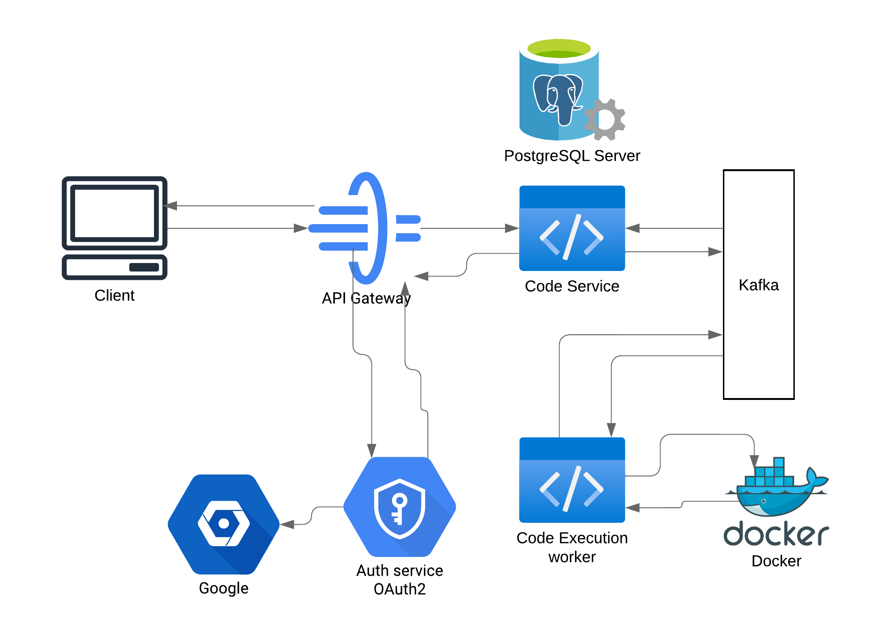

#### readme top

<!-- PROJECT LOGO -->
<br />
<div align="center">

  <h3 align="center">Jcode</h3>

  <p align="center">
    Code execution platform
    <br />
<!--     <a href="https://github.com/St3plox/Blogchain"><strong>Explore the docs »</strong></a> -->
    <br />
    <br />
    <a href="https://github.com/St3plox/jcode/issues/new?labels=bug&template=bug-report---.md">Report Bug</a>
    ·
    <a href="https://github.com/St3plox/jcode/issues/new?labels=enhancement&template=feature-request---.md">Request Feature</a>
    .
    <a href="https://pkg.go.dev/github.com/St3plox/jcode">Documentation</a>
  </p>
</div>


<!-- TABLE OF CONTENTS -->
<details>
  <summary>Table of Contents</summary>
  <ol>
    <li>
      <a href="#about-the-project">About The Project</a>
      <ul>
        <li><a href="#built-with">Built With</a></li>
      </ul>
    </li>
    <li> <a href="#service-design">Service design<a/></li>
    <li>
      <a href="#getting-started">Getting Started</a>
      <ul>
        <li><a href="#prerequisites">Prerequisites</a></li>
        <li><a href="#installation">Installation</a></li>
      </ul>
    </li>
    <li><a href="#roadmap">Roadmap</a></li>
    <li><a href="#contributing">Contributing</a></li>
    <li><a href="#license">License</a></li>
    <li><a href="#contact">Contact</a></li>
  </ol>
</details>


<!-- ABOUT THE PROJECT -->
## About The Project

A simple code execution platform that uses docker container to execute code. Currently supports Go, Java, Python languages.
Uses microservice architecture for backend and apache kafka for async communication between code service and execution worker.

<p align="right">(<a href="#readme-top">back to top</a>)</p>


### Built With

* [![Java][Java]][Java-url]
* [![Golang][Golang]][Golang-url]
* [![Apache-Kafka][Apache-Kafka]][Apache-Kafka-url]
* [![PostgreSQL][PostgreSQL]][PostgreSQL-url]
* [![Spring][Spring]][Spring-url]

<p align="right">(<a href="#readme-top">back to top</a>)</p>


### Service design

<p align="right">(<a href="#readme-top">back to top</a>)</p>

<!-- GETTING STARTED -->
## Getting Started
At current state of the project you need to be able to launch gradle and go projects locally and Postgresql, kafka and zookeeper optionally via docker-compose or locally. In future I will dockerize all the services.

### Prerequisites
*docker
*docker-compose
*java-17
*go-1.22
*gradle

### Installation

1. Clone the repo
   ```bash
   git clone https://github.com/St3plox/jcode
   cd jcode
   ```
   
2. Launch kafka, zookeeper and postgresql servers. 
   ```bash
   docker-compose up -d
   ```

3. Run java services
   ```bash
    ./gradlew build
    ./gradlew :discovery-server:bootRun
    ./gradlew :auth-service:bootRun
    ./gradlew :api-gateway:bootRun
    ./gradlew :code-service:bootRun
    cd code-exec-worker
    go run ./cmd
   ```
Frontend can be accessed on port 8080, backend - 3000, swagger - 4000

<p align="right">(<a href="#readme-top">back to top</a>)</p>


<!-- ROADMAP -->
## Roadmap

- [ ] Async execution
- [ ] Caching
- [ ] Documentation
- [ ] Auth
- [ ] Testing 
- [ ] More functionality (Tasks)

See the [open issues](https://github.com/St3plox/jcode/issues) for a full list of proposed features (and known issues).

<p align="right">(<a href="#readme-top">back to top</a>)</p>


<!-- CONTRIBUTING -->
## Contributing

Contributions are what make the open source community such an amazing place to learn, inspire, and create. Any contributions you make are **greatly appreciated**.

If you have a suggestion that would make this better, please fork the repo and create a pull request. You can also simply open an issue with the tag "enhancement".
Don't forget to give the project a star! Thanks again!

1. Fork the Project
2. Create your Feature Branch (`git checkout -b feature/AmazingFeature`)
3. Commit your Changes (`git commit -m 'Add some AmazingFeature'`)
4. Push to the Branch (`git push origin feature/AmazingFeature`)
5. Open a Pull Request

<p align="right">(<a href="#readme-top">back to top</a>)</p>


<!-- LICENSE -->
## License

Distributed under the MIT License. See `LICENSE.txt` for more information.

<p align="right">(<a href="#readme-top">back to top</a>)</p>


<!-- CONTACT -->
## Contact

Egor - st3pegor@gmail.com


<p align="right">(<a href="#readme-top">back to top</a>)</p>


<p align="right">(<a href="#readme-top">back to top</a>)</p>

<!-- MARKDOWN LINKS & IMAGES -->
<!-- https://www.markdownguide.org/basic-syntax/#reference-style-links -->
[Java]: https://img.shields.io/badge/Java-007396?style=for-the-badge&logo=java&logoColor=white
[Java-url]: https://www.oracle.com/java/

[Golang]: https://img.shields.io/badge/go-00ADD8?style=for-the-badge&logo=go&logoColor=white
[Golang-url]: https://golang.org/

[Apache-Kafka]: https://img.shields.io/badge/Apache_Kafka-231F20?style=for-the-badge&logo=apache-kafka&logoColor=white
[Apache-Kafka-url]: https://kafka.apache.org/

[PostgreSQL]: https://img.shields.io/badge/PostgreSQL-336791?style=for-the-badge&logo=postgresql&logoColor=white
[PostgreSQL-url]: https://www.postgresql.org/

[Spring]: https://img.shields.io/badge/Spring-6DB33F?style=for-the-badge&logo=spring&logoColor=white
[Spring-url]: https://spring.io/

